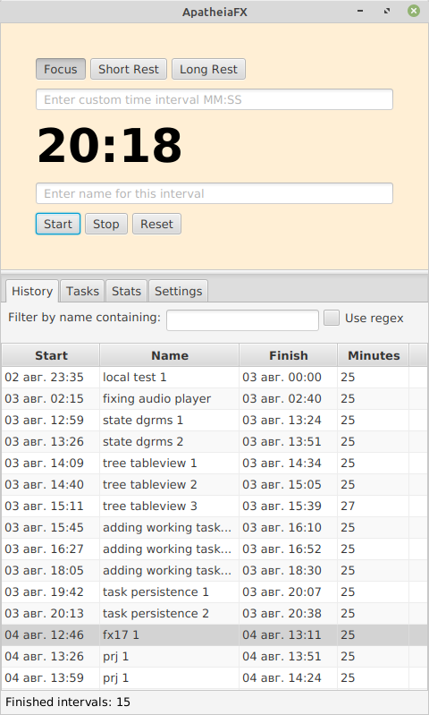
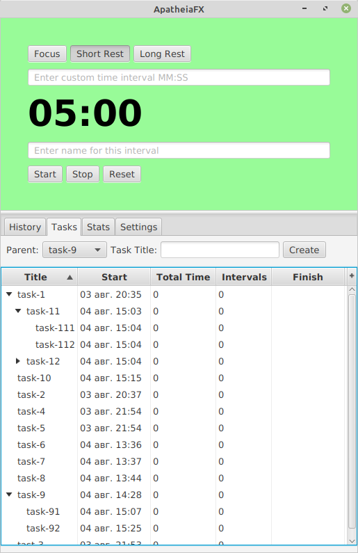

# apatheia-fx

Трекер рабочих интервалов и задач.
- использование таймера для отслеживания интервалов
- редактирование и удаление интервалов
- сохранение и фильтрация отображения интервалов
- создание и сохранение рабочих задач и подзадач

|  |  |
|--|----------------------------------|

Используются:
- JavaFX
- Kotlin
- Spring Boot
- H2

Способы запуска:
- или из проекта:
  - через главный класс `AppMainSpring`
  - через Gradle task `bootRun`
- или используя собранный Jar
  - собрать jar с помощью Gradle task 'bootJar'
  - собранный jar находится в `build/libs`
  - запустить полученный jar: `java -jar name-of-jar-file`
- после первого запуска в текущей директории будет создан файл локальной базы данных
